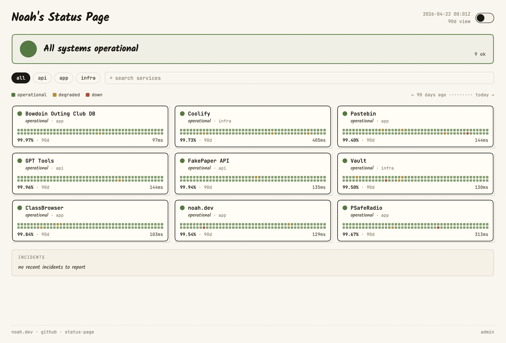

<h1 align="center">status-page</h1>

<p align="center">A self-hosted status page with real-time monitoring</p>

<p align="center">
  
</p>

A lightweight, single-binary status page application. Monitor your services with HTTP and TCP probes, manage incidents and maintenance windows, and display real-time uptime to your users.

## Install

**Download the latest release** (Linux x86_64)

```sh
curl -L https://github.com/rossnoah/status-page/releases/latest/download/status-page-linux-x86_64.tar.gz | tar xz
sudo mv status-page /usr/local/bin/
```

**Deploy with systemd** (Linux x86_64)

```sh
# Download and install binary
curl -L https://github.com/rossnoah/status-page/releases/latest/download/status-page-linux-x86_64.tar.gz | tar xz
sudo mv status-page /usr/local/bin/

# Create dedicated user/group and data directory
sudo useradd --system --no-create-home --shell /usr/sbin/nologin status-page
sudo mkdir -p /var/lib/status-page
sudo chown status-page:status-page /var/lib/status-page

# Install and start service
sudo cp deploy/status-page.service /etc/systemd/system/
sudo systemctl daemon-reload
sudo systemctl enable --now status-page
# Then setup cloudflared tunnel pointing at localhost:8080
```

**Or install from source**

```sh
cargo install --git https://github.com/rossnoah/status-page
```

## Usage

Start the server:

```sh
status-page
```

Then visit `http://localhost:8080` to view the public status page, or `http://localhost:8080/admin/setup` to create your admin account.

## Migrating from another status page

You can bulk-import services using the JSON import. The easiest way to migrate is to screenshot your current status page and ask an LLM (e.g. ChatGPT, Claude) to generate a JSON matching the schema below.

**Example prompt** (attach a screenshot of your status page):

> Look at this screenshot of my status page. Generate a JSON object that I can use to import all the services shown into a new status page. Use this exact format:
>
> `{ "version": 1, "exported_at": "<now>", "services": [{ "name", "category", "url", "probe_type", "probe_config", "interval_secs", "region", "is_public", "enabled", "sort_order" }] }`
>
> For each service, infer the URL from the name/context if it's visible. Set `probe_type` to `"http"` for websites/APIs or `"tcp"` for raw ports. Use `category` values like `"api"`, `"app"`, or `"infra"` based on what makes sense. Set `interval_secs` to 30. Output only the JSON, no explanation.

## Configuration

Configure via environment variables:

| Variable         | Default          | Description                     |
| ---------------- | ---------------- | ------------------------------- |
| `HOST`           | `0.0.0.0`        | Bind address                    |
| `PORT`           | `8080`           | Listen port                     |
| `DATABASE_PATH`  | `data/status.db` | SQLite database file path       |
| `ADMIN_PASSWORD` | —                | Pre-set admin password on setup |

Example:

```sh
PORT=3000 DATABASE_PATH=/var/lib/status-page/db.sqlite status-page
```
